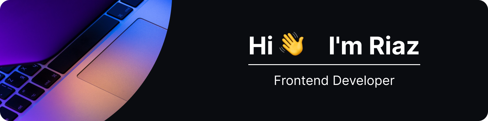

🚀 1.5+ years in Frontend Development, Higher technical education (GPA 4.2), collaboration in international cross-functional teams 
⚒️ Technology Stack: HTML, CSS, JavaScript, React, Next, Redux, TypeScript, Tailwind 
🌱 Learning: Astro, Firebase, SQL, MongoDB 
🤖 Solid in Algorithms and DSA, skilled in Figma Design, proficient in Git & Jira 
💬 Fluently speak English, Russian & Tatar, know some Turkish 
🧑🏻‍💻 Eager to create eye-catching interfaces with cutting-edge web technologies 
🎯 Focused on blending aesthetics and functionality, driven by a keen eye for detail 
📈 Goal for the nearest future is to continuously evolve in the realm of modern Frontend Development 
🤝 Always open to collaborating on interesting projects 
✉️ Visit my <a href="https://www.mirzaianov.com/">Website</a>, shoot a dm in <a href="https://t.me/mirzaianov">Telegram</a> or contact via <a href="mailto:hello@mirzaianov.com">Email</a> 
🌍 I'm based in Novi Sad, Serbia 
⚡ Fun fact: I have a category in chess 

<h3 align="center">Tech Stack</h3>

  
  
  
  &nbsp;&nbsp;&nbsp;&nbsp;&nbsp;&nbsp;&nbsp;&nbsp;&nbsp;&nbsp;
  
  
  
  
  
   
   
  
  
  &nbsp;&nbsp;&nbsp;&nbsp;&nbsp;&nbsp;&nbsp;&nbsp;&nbsp;&nbsp;
  
  
  &nbsp;&nbsp;&nbsp;&nbsp;&nbsp;&nbsp;&nbsp;&nbsp;&nbsp;&nbsp;
  
  
  

<h3 align="center">Badges</h3>

  

  

  

