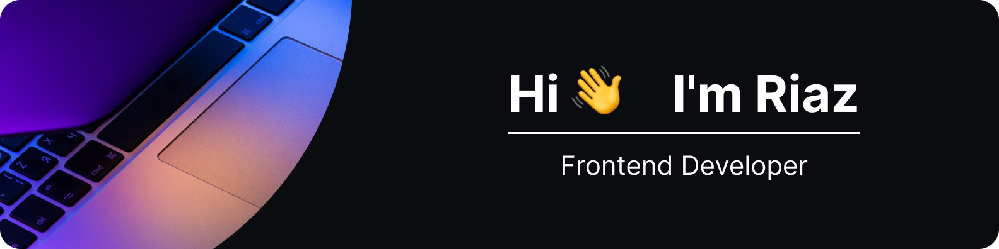

🚀 1.5+ years in Frontend Development, Higher technical education (GPA 4.2), Collaboration in international cross-functional teams 
⚒️ Technology Stack: HTML, CSS, JavaScript, React, Next, Redux, TypeScript, Tailwind, Vitest / Testing Library 
🌱 Learning: Astro, Firebase, SQL, MongoDB 
🤖 Solid in Algorithms and DSA, skilled in Figma Design, proficient in Git & Jira 
💬 Fluently speak English, Russian & Tatar, know some Turkish 
🧑🏻‍💻 Eager to create eye-catching interfaces with cutting-edge web technologies 
🎯 Focused on blending aesthetics and functionality, driven by a keen eye for detail 
📈 Goal for the nearest future is to continuously evolve in the realm of modern Frontend Development 
🤝 Always open to collaborating on interesting projects 
✉️ Visit my [Website](https://www.mirzaianov.com/), shoot a dm in [Telegram](https://t.me/mirzaianov) or contact via [Email](mailto:hello@mirzaianov.com) 
🌍 I'm based in Novi Sad, Serbia 
⚡ Fun fact: I have a category in chess 

<h3 align="center">Tech Stack</h3>

&nbsp;&nbsp;&nbsp;&nbsp;&nbsp;&nbsp;&nbsp;&nbsp;&nbsp;&nbsp; 

&nbsp;&nbsp;&nbsp;&nbsp;&nbsp;&nbsp;&nbsp;&nbsp;&nbsp;&nbsp; &nbsp;&nbsp;&nbsp;&nbsp;&nbsp;&nbsp;&nbsp;&nbsp;&nbsp;&nbsp; 

&nbsp;&nbsp;&nbsp;&nbsp;&nbsp;&nbsp;&nbsp;&nbsp;&nbsp;&nbsp; 

<h3 align="center">Badges</h3>

  

  

  

